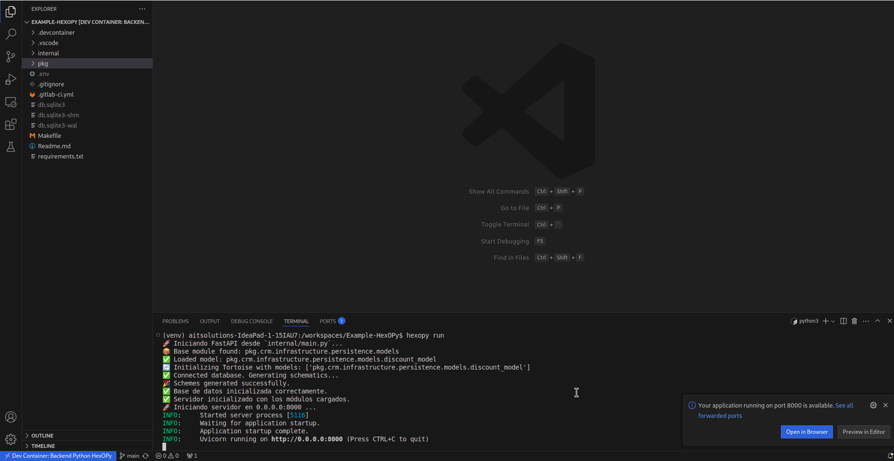

# HexOPy 🛠️🐍 – Hexagonal Architecture for Python  

HexOPy es un **boilerplate ligero y escalable** para desarrollar aplicaciones en Python siguiendo la **arquitectura hexagonal**. Diseñado para facilitar la organización del código, mejorar la mantenibilidad y permitir una fácil integración con diferentes frameworks y bases de datos.  

## 🚀 Características  
✔️ Estructura modular basada en **puertos y adaptadores**  
✔️ Separación clara entre **dominio, aplicación e infraestructura**  
✔️ Soporte para **FastAPI, Flask o Django** (configurable)  
✔️ Integración sencilla con **PostgreSQL, MongoDB, SQLite**  
✔️ Diseñado para **microservicios y aplicaciones monolíticas escalables**  

## 📦 Instalación  
```bash
git clone https://github.com/njavilas2015/example-hexopy.git  
pip install -r requirements.txt  
```

## Como iniciar?


## 📖 Documentación  
Consulta la [documentación oficial](#) para aprender cómo estructurar tu aplicación con HexOPy.  

## 🤝 Contribuciones  
¡Las contribuciones son bienvenidas! Crea un **issue** o envía un **pull request** para mejorar el proyecto.  

📜 Licencia: MIT  
